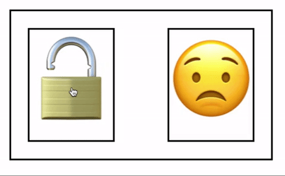

# react-state-redux-context
React State vs Redux vs Context

This project was bootstrapped with [Create React App](https://github.com/facebookincubator/create-react-app).

Instructions:
* `npm install` or `yarn install` to install dependencies
* `npm start` or `yarn start` to run the project.
* The page will show a lock and a smiley. Clicking on lock will toggle it as well as the smiley
  

<!---
Details about state management:
* Branch `master` uses React state
* Branch `redux` uses Redux
* Branch `context` uses React Context
--->